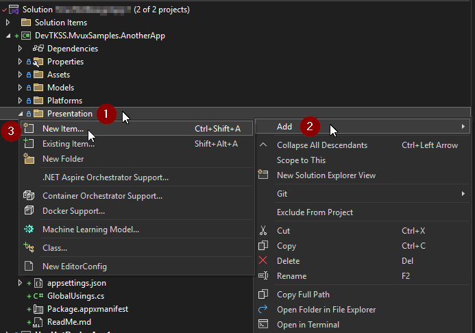
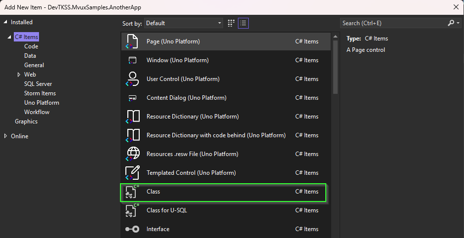

<!-- markdownlint-disable MD051 -->
# How-To: Navigate in XAML

This topic walks through controlling Navigation from XAML. This includes specifying data that should be attached to the navigation request.

## Step-by-step

[!include[create-application](../includes/create-application.md)]

> [!INFO]
> Make sure to opt-in to `Uno.Regions` (in `dotnet new` CLI, the option you need to add is `-nav regions`) to use the Uno Navigation and get your `App.xaml.cs` prepared with the `RegisterRoutes`. Otherwise, it defaults to [***Native Frame Navigation***](https://platform.uno/docs/articles/guides/native-frame-nav-tutorial.html).

## [MVVM](#tab/mvvm)

[!include [getting-help](../includes/mvvm-approach.md)]

## [MVUX](#tab/mvux)

[!include [getting-help](../includes/mvux-approach.md)]

---

### 1. Navigation.Request

[!INCLUDE [navigate-xaml-request](./includes/navigate-xaml-request.md)]

#### [MVVM Setup](#tab/mvvm/setup)

- Add a new class, `SampleViewModel`, to the project:

    ```csharp
    public class SampleViewModel
    {
        private readonly INavigator _navigator;

        public SampleViewModel(INavigator navigator)
        {
            _navigator = navigator;
        }

    }
    ```

#### [MVUX Setup](#tab/mvux/setup)

- Add a new class, `SampleViewModel`, to the project:

    
    
    
    

    > [!TIP]
    > You can use Visual Studio Snippets for the constructor by using the `ctor` keyword. Afterwards you only need to add the required Service Interfaces for DI and transfer them to their fields to make them available not only in the Constructor.

    ```csharp
    public class SampleModel
    {
        private readonly INavigator _navigator;

        public SampleModel(INavigator navigator)
        {
            _navigator = navigator;
        }
    }
    ```

---

- As Navigation.Request attached property exists in the `Uno.Extensions.Navigation.UI` namespace you will need to import this namespace on the `Page` element:

    ```csharp
    <Page x:Class="NavigateInXAML.Views.SamplePage"
        ...
        xmlns:uen="using:Uno.Extensions.Navigation.UI">
    ```

- In `MainPage.xaml` update the `Button` you got from the templated App to use the `Navigation.Request` attached property instead of the `Click` event handler.

    ```xml
    <Button Content="Go to SamplePage"
            uen:Navigation.Request="Sample" />
    ```

- In `SamplePage.xaml` add a `Button`, again with the `Navigation.Request` attached property. The "-" navigation route is used to navigate back.

    ```xml
    <Button Content="Go Back"
            uen:Navigation.Request="-" />
    ```

    > [!TIP]
    > While this works, it relies on reflection to convert the request path "Sample" to the corresponding view, i.e. `SamplePage`. It's better to define `ViewMap` and `RouteMap`

- Add a `ViewMap` and a `RouteMap` for the `SamplePage` into the `RegisterRoutes` method in the `App.xaml.cs` file:

#### [Register Routes MVVM](#tab/mvvm/RegisterRoutes)

[!INCLUDE [register-routes-mvvm](./includes/register-routes-mvvm.md)]

#### [Register Routes MVUX](#tab/mvux/RegisterRoutes)

[!INCLUDE [register-routes-mvux](./includes/register-routes-mvux.md)]

---

### 2. Navigation.Data

#### [MVVM](#tab/mvvm/NavigationData)

In addition to specifying the route to navigate to, the Navigation.Data attached property can be used to define the data to be attached to the navigation request. The data can be accessed by the view model associated with the route using constructor injection.

[!INCLUDE [navigation-data-inline](./includes/navigation-data-inline.md)]

- Add a property, `Widgets`, to `MainViewModel` that returns an array of predefined `Widget` instances.

[!INCLUDE [navigation-widgets-inline](./includes/navigation-widgets-inline.md)]

- Update `SecondViewModel` to accept a `Widget` as the second constructor parameter

    ```csharp
    public class SampleViewModel
    {
        public string Title => "Sample Page";

        public string Name { get; }

        public SampleViewModel(Widget widget)
        {
            Name = widget.Name;
        }
    }

    ```

[!INCLUDE [navigation-showing-widgets](./includes/navigation-showing-widgets-inline.md)]

- In order for the `Widget` to be injected into the `SampleViewModel` during navigation, a `DataMap` has to be added to the `ViewMap`. Therefore, we can change the `ViewMap` instantiation to `DataViewMap` and provide the `Widget` as a generic argument:

    ```csharp
    new DataViewMap<SamplePage, SampleViewModel, Widget>()
    ```

#### [MVUX](#tab/mvux/NavigationData)

In addition to specifying the route to navigate to, the Navigation.Data attached property can be used to define the data to be attached to the navigation request. The data can be accessed by the appropriate model associated with the route using constructor injection.

[!INCLUDE [navigation-data-inline](./includes/navigation-data-inline.md)]

- Add a property, `Widgets`, to `MainModel` that returns an array of predefined `Widget` instances.

    [!INCLUDE [navigation-widgets-inline](./includes/navigation-widgets-inline.md)]

- Update `SecondModel` to accept a `Widget` as the second constructor parameter

    ```csharp
    public class SampleModel
    {
        public string Title => "Sample Page";

        public string Name { get; }

        public SampleModel(Widget widget)
        {
            Name = widget.Name;
        }
    }

    ```

[!INCLUDE [navigation-showing-widgets](./includes/navigation-showing-widgets-inline.md)]

- In order for the `Widget` to be injected into the `SampleModel` during navigation, a `DataMap` has to be added to the `ViewMap`. Therefore, we can change the `ViewMap` instantiation to `DataViewMap` and provide the `Widget` as a generic argument:

    ```csharp
    new DataViewMap<SamplePage, SampleModel, Widget>()
    ```

---

### 3. Navigating To SelectedItem

Instead of having to select an item in the `ListView` and then clicking on the `Button`, Navigation can be triggered when the user selects an item in the `ListView`.

- Add the `Navigation.Request` property to the `ListView`. The `Navigation.Data` property is not required as the selected item will automatically be attached to the navigation request. Also remove the `SelectionMode` property as it is no longer necessary for the `ListView` to track the selected item.

    ```xml
    <ListView ItemsSource="{Binding Widgets}"
              uen:Navigation.Request="Sample">
        <ListView.ItemTemplate>
            <DataTemplate>
                <StackPanel Orientation="Horizontal"
                            Padding="10">
                    <TextBlock Text="{Binding Name}" />
                    <TextBlock Text="{Binding Age}" />
                </StackPanel>
            </DataTemplate>
        </ListView.ItemTemplate>
    </ListView>
    ```

Beside the `ListView` Control, you can also use the `NavigationView` from WinUI3 instead for your Navigation!

- [HowTo-UseNavigationView](./Advanced/HowTo-UseNavigationView.md)
